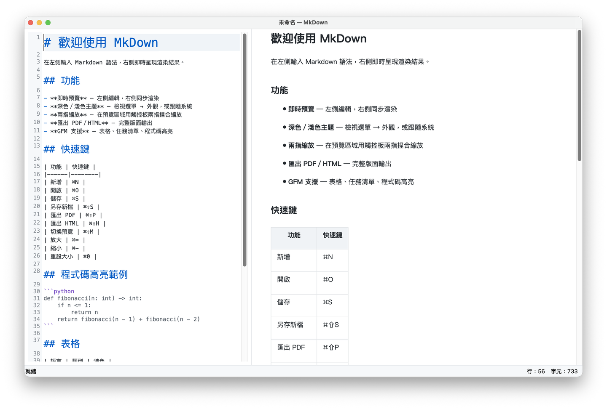
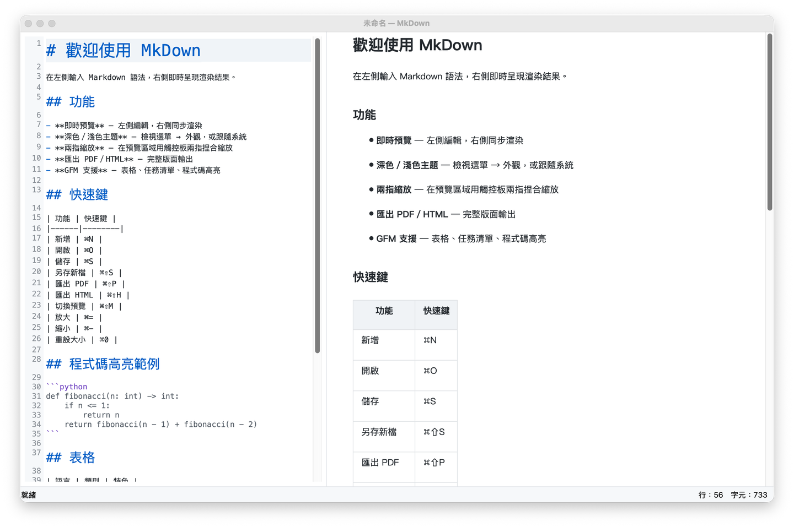

# MkDown

A minimal macOS Markdown editor with a live split-pane preview, dark mode support, and pinch-to-zoom — inspired by [MacDown](https://macdown.uranusjr.com/).

## Features

- **Split-pane layout** — edit Markdown on the left, see the rendered result on the right in real time
- **Syntax highlighting** — headers, bold, italic, code blocks, links, and more highlighted in the editor; colours adapt to light/dark theme automatically
- **Dark / Light / Auto theme** — follows macOS system appearance, or set manually via the View menu
- **Pinch-to-zoom** — use a two-finger trackpad gesture to zoom the preview
- **Chinese-friendly font** — preview uses PingFang TC (蘋方-繁) for comfortable Traditional Chinese reading
- **Code block highlighting** — fenced code blocks are syntax-coloured via [Pygments](https://pygments.org/) (friendly / monokai styles for light / dark mode)
- **WCAG AAA contrast** — all foreground/background colour pairs meet WCAG AA/AAA contrast requirements in both themes
- **Export to PDF** — full-fidelity PDF output via Qt's print engine
- **Export to HTML** — self-contained HTML file with all styles embedded
- **Open from CLI** — `python3 main.py README.md`
- **GFM support** — tables, task lists, footnotes, definition lists, admonitions

## Screenshots

| Light mode | Dark mode |
|---|---|
|  |  |

## Requirements

- macOS 11 or later
- Python 3.10+

## Quick start

```bash
git clone https://github.com/AndyJuang/mkdown.git
cd mkdown
pip install -r requirements.txt
python3 main.py
```

## Install as a native .app

Build a self-contained macOS application bundle with PyInstaller:

```bash
pip install pyinstaller pillow
python3 make_icon.py          # generates MkDown.icns
pyinstaller MkDown.spec --clean -y
open dist/MkDown.app
```

The resulting `dist/MkDown.app` (~150 MB, includes the full Qt framework) can be copied to `/Applications`.

> **First-launch note:** macOS may show an "unidentified developer" warning because the binary is not notarised.  
> Right-click → **Open** → **Open** to bypass it, or go to **System Settings → Privacy & Security** and click **Open Anyway**.

## Keyboard shortcuts

| Action | Shortcut |
|---|---|
| New file | ⌘N |
| Open file | ⌘O |
| Save | ⌘S |
| Save As | ⌘⇧S |
| Export PDF | ⌘⇧P |
| Export HTML | ⌘⇧H |
| Toggle preview | ⌘⇧M |
| Zoom in | ⌘= |
| Zoom out | ⌘– |
| Reset zoom | ⌘0 |

## Project structure

```
mkdown/
├── main.py          # Entry point
├── window.py        # Main window, menus, file operations
├── editor.py        # Code editor widget with line numbers & syntax highlight
├── highlighter.py   # QSyntaxHighlighter for Markdown (theme-aware)
├── preview.py       # Live preview widget (QTextBrowser + Pygments)
├── theme.py         # Light / dark / auto theme manager
├── wcag_fix.py      # WCAG contrast audit & colour adjustment script
├── requirements.txt
└── MkDown.spec      # PyInstaller build spec
```

## Dependencies

| Package | Purpose |
|---|---|
| PyQt5 | GUI framework |
| PyQtWebEngine | (listed in requirements, not used at runtime — QTextBrowser is used instead for stability on macOS 15+) |
| Markdown | Markdown → HTML rendering |
| Pygments | Syntax highlighting for code blocks |

## License

MIT
